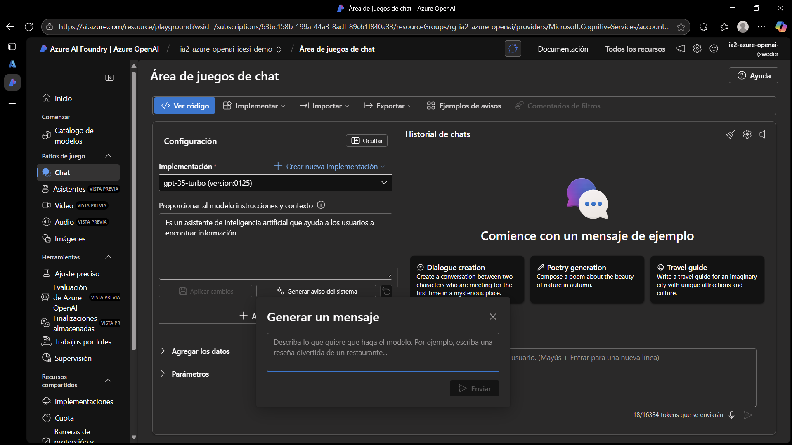
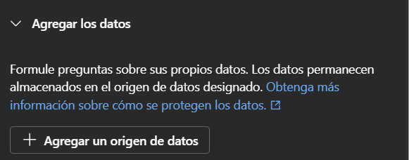

# Azure OpenAI Service

**Objetivo del taller:** Comprender el potencial que existe en Azure OpenAI Service y entender su importancia

## Lo que ya sabemos

Si en este momento queremos hacer uso de la api de ChatGPT o Gemini para nuestros proyectos generaríamos nuestra API key y la usaríamos a través de código como el siguiente:

```python
import os
from openai import OpenAI

client = OpenAI(
    # This is the default and can be omitted
    api_key=os.environ.get("OPENAI_API_KEY"),
)

response = client.responses.create(
    model="gpt-4o",
    instructions="You are a coding assistant that talks like a pirate.",
    input="How do I check if a Python object is an instance of a class?",
)

print(response.output_text)
```

Sin embargo, nos encontramos limitados ya que no nos ofrecen créditos estudiantiles ni se nos permite modificar los parámetros del modelo más allá de su nombre y el número de intentos.

## Lo nuevo

-   Azure AI Foundry es una solución de “fábrica de aplicaciones y agentes de IA” (AI app & agent factory). Permite diseñar, personalizar y administrar aplicaciones y agentes de IA a escala.
    
-   Ofrece un catálogo unificado de modelos (modelos base, modelos de tarea específica, modelos de industria) incluyendo modelos de OpenAI, Microsoft, y otros proveedores.
    
-   Incluye capacidades de orquestación de agentes (agent service), mecanismos de personalización como fine-tuning, recuperación aumentada (RAG, retrieval augmented generation), estrategias de seguridad, filtros de contenido, monitoreo y gobernanza.
    
-   Tiene una API/SDK unificada para trabajar con modelos, agentes y flujos de IA.
    
-   Soporta dos tipos de proyectos: proyectos basados en recurso Foundry, y proyectos “hub-based” (dependiendo de cómo esté organizada la arquitectura)
    
-   Se puede “convertir/actualizar” un recurso de **Azure OpenAI** existente a un recurso **Azure AI Foundry**, para obtener ventajas adicionales de organización, catálogo y gobernanza.

## ¿Qué es entonces Azure OpenAI Service?

No están completamente separados: más bien, Azure AI Foundry _incorpora_ y _extiende_ el alcance de Azure OpenAI (entre otros modelos). Algunas relaciones clave:

|Concepto|Relación / integración|
|--|--|
|Modelos de OpenAI|Dentro de Azure AI Foundry, puedes usar modelos de OpenAI como parte del catálogo de modelos disponibles (“Foundry Models”)|
|Seguridad, gobernanza, controles|Azure OpenAI ya ofrece seguridad y control de acceso, pero Foundry agrega control en el ciclo de vida de los agentes, monitoreo, filtros de contenido, evaluación continua, etc.|
|Organización de proyectos|Azure AI Foundry introduce la noción de “proyectos” dentro de un recurso Foundry para separar distintos casos de uso, gestionar permisos, aislar datos, etc.|
|Migración / actualización|Puedes tomar un recurso Azure OpenAI existente y “convertirlo” a un recurso Azure AI Foundry, para beneficiarte de las capacidades adicionales de Foundry sin perder compatibilidad.|
|Catálogo multifuente de modelos|Mientras que Azure OpenAI está centrado en los modelos de OpenAI, Foundry permite que coexistan modelos de múltiples proveedores (OpenAI, Microsoft, xAI, DeepSeek, etc.) bajo una plataforma común.|

En resumen: **Azure AI Foundry** es una capa superior / plataforma de gestión de IA que incorpora **Azure OpenAI Service** como uno de sus componentes de modelo, pero facilita también la integración, personalización, gobierno, despliegue y operación de modelos, agentes y aplicaciones de IA en escala.

## Modelos

1. Acceder a https://azure.microsoft.com/

2. Iniciar sesión con una cuenta de Microsoft que cuente con créditos estudiantiles habilitados

3. En la barra de búsqueda escribimos grupos de recursos o resource group y creamos un nuevo grupo en la región de nuestra elección (Preferiblemente alguna de US, Europa o Canadá)


4. Buscamos en la barra de búsqueda Azure OpenAI y seleccionamos la opción de crear, le asignamos el grupo de recursos que creamos previamente, elegimos región (Preferiblemente East US o East US 2), le damos un nombre, permitimos que todas las redes puedan acceder al recurso y le damos a crear. Si nos encontramos el siguiente error:


```
{
  "code": "InvalidTemplateDeployment",
  "details": [
    {
      "code": "InsufficientQuota",
      "message": "Insufficient quota. Cannot create/update/move resource 'ia2-azure-openai'."
    }
  ],
  "message": "La implementación de la plantilla \"OpenAICreate-20250927165230\" no es válida de acuerdo con el procedimiento de validación. El id. de seguimiento es \"a7e70d2e-a1fa-40c8-9d18-0629bfb9368d\". Vea los errores internos para obtener más detalles."
}
```

* Esto significa que debemos cambiar la región del recurso por una en la que sí haya disponibilidad. Los equipos necesarios para la IA son costosos y escasos por lo que desde un inicio ya hay recursos establecidos y asignados a lo largo de las diferentes regiones. Si una región ya está ocupada en su totalidad no importa si somos estudiantes, empresas, paguemos, etc, porque no hay más hardware disponible. Usualmente lo más fácil es probar East US, East US 2, Canadá o Europa.

5.  Tras crearse nos dirigimos al recurso y nos dirigimos al portal de fundición de IA o AI Foundry


6. Una vez dentro nos dirigimos al menú de la derecha y vamos a catálogo vamos a encontrar todos los modelos de OpenAI disponibles.


7. Nos dirigimos a la opción de Chat en el menú de la izquierda y oprimimos en crear una implementación, elegimos el modelo de nuestra preferencia, recomendamos el uso de GPT-35-Turbo por ser el más económico y lo ponemos a crear.

8. Ahora tenemos nuestra propia implementación de ChatGPT, se nos permite editar un System prompt para el modelo ya sea de forma manual o generarlo con IA



**Debemos asegurarnos de que nuestro modelo se cree en la misma región que nuestro azure ai foundry sino NO FUNCIONARÁN LO SIGUIENTE**


9. Podemos a su vez añadir mensajes del sistema de seguridad, ejemplos y variables


10. Agregar datos (RAG)



11. Modificar todo tipo de parámetros


12. Observar la implementación de código del chat


### Actividad 1

* Elige un modelo de tu elección y modifica su system prompt. De forma opcional puedes añadir ejemplos, variables, datos y los parámetros. Y realiza una consulta o pregunta. Haz lo mismo con el ChatGPT convencional del navegador y compara su respuesta.

* ¿Qué potencial identificas en Azure OpenAI?
* ¿Por qué lo eligirían las empresas?

## Agentes

1. En el menú de la izquierda dirígite a la sección de asistentes y crea uno con el mismo modelo que implementamos previamente


2. De nuevo nos encontramos con la posibilidad de darle instrucciones (paso a paso) y descripción (personalidad) a nuestro asistente


3. Le podemos incluir herramientas ya existentes como file search o code interpreter o crear las nuestras añadiendo funciones en el código de la implementación y adjuntando en formato json la forma en que puede llamarlas


4. Y a su vez podemos modificar algunos parámetros del modelo desde el agente


### Actividad 2

* Crea un agente para alguna función en específico que elijas dándole instrucciones sobre cómo hacer lo que le pides y darle una descripción para que se apegue a ese comportamiento y personalidad. Adjunta capturas sobre un chat con tu agente

* Ve a la opción de herramientas y añade una de las funciones de ejemplo (get_weather, get_stock_price) haz que tu agente las llame, qué ocurre? Por qué ocurre?

* (Opcional) Copia el código de tu agente en Visual Studio Code y muestra comó logras acceder a él a través de una API

## Video / Audio / Imágenes

Los modelos de ChatGPT sora, whisper, dalle entre otros se encargan de operaciones como generar videos, audios, imágenes y reconocer voces. Sin embargo debido a su alta demanda y costo su uso en la guía no está asegurado pero lo intentaremos

### Actividad 3 (Si no logras hacerla adjunta una captura y di el por qué)

* Nos dirigimos al menú de la izquierda y seleccionamos la opción de Audio y creamos una implementación (En mi caso probé con tts) ten cuidado ya que aquí los intentos son mucho más limitados, tts nos permite generar audio a través de texto. Vas a escribir lo que quieres que el modelo diga (Evita palabras inapropiadas ya que Microsoft revisa todo lo que solicitas)


* Tras obtener tu audio descárgalo y adjúntalo en la entrega

* ¿Qué potencial tienen los modelos audio-audio, texto-audio y de reconocimiento de voz? ¿Cuáles serían sus posibles aplicaciones?

## Extras

Azure OpenAI service además nos ofrece los servicios de Ajuste Preciso (Fine-tunning), Evaluación de Azure OpenAI (Métricas según tareas), Finalizaciones almacenadas (Captura de conversaciones para evaluación), Trabajo por lotes y Supervisión (Uso de API)

### Actividad 4

* ¿Cómo se diferencia Azure OpenAI Service de Microsoft Copilot Studio?