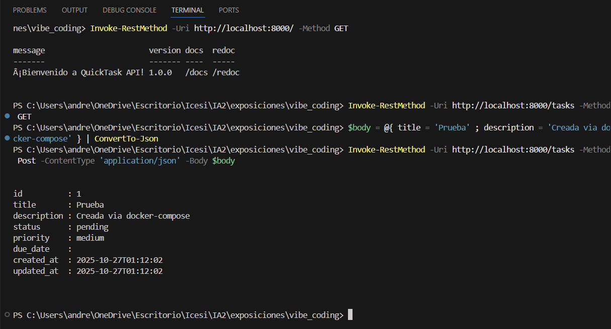

# Guía Vibe Coding

Los resultados de cada etapa se pueden encontrar en los siguientes archivos:

* Levantamiento de Requerimientos -> requerimientos.md (GPT mini)
* Análisis Funcional y Técnico -> analisis.md (GPT-5 mini)
* Diagramas UML -> diagramas.md (GPT-5 mini)
* Diseño de Base de Datos y Arquitectura -> db.md (Claude Haiku 4.5)
* Desarrollo del código -> quicktask_backend (Claude Haiku 4.5) (Hizo todo de nuevo y le incluyó pruebas en su subcarpeta)
* Pruebas unitarias -> pytest_gpt_5_mini (GPT-5 mini)
* Despliegue del sistema -> Dockerfile, Docker.md y docker-compose.yaml (GPT-5 mini)

Ejemplos de llamados:

