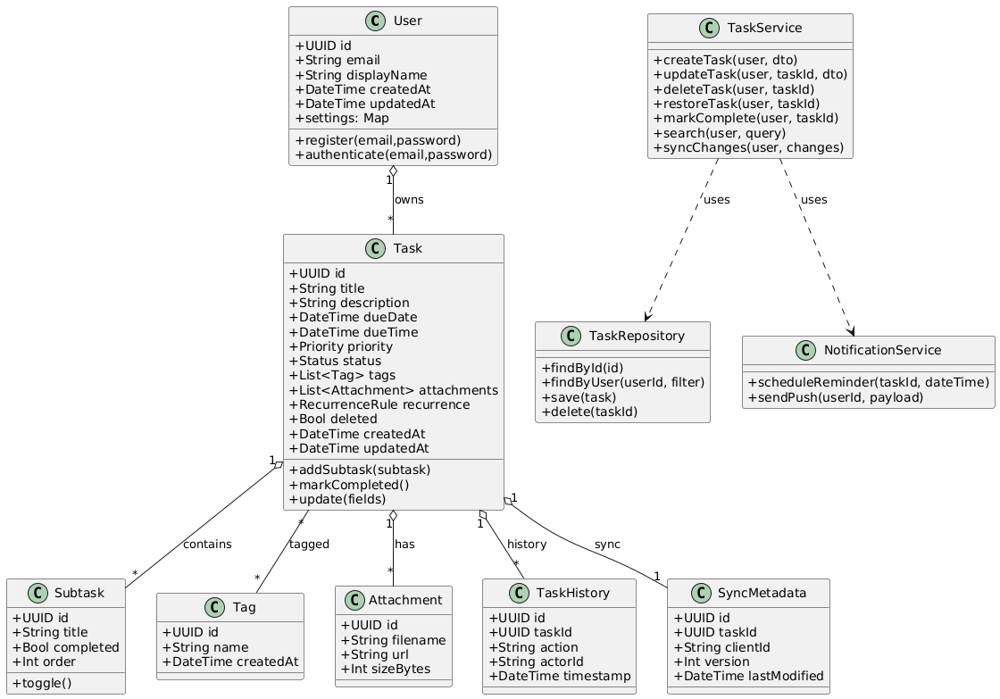

## Diagrama de Casos de Uso (PlantUML)

## Diagrama de Clases (PlantUML)

## Explicación breve

- Diagrama de Casos de Uso: muestra actores y los casos de uso principales cubiertos por los requerimientos. El actor `User` puede operar en modo local o (opcionalmente) registrarse para sincronización; `AuthService` y `NotificationService` aparecen como actores externos opcionales para reflejar funciones de autenticación y envío de recordatorios/push.

- Diagrama de Clases: define el modelo de dominio esencial y los servicios que encapsulan la lógica (por ejemplo `TaskService` y `TaskRepository`). Incluye entidades persistentes (`Task`, `Subtask`, `Tag`, `Attachment`, `TaskHistory`, `SyncMetadata`) con atributos clave y métodos representativos. Las relaciones muestran propiedad y cardinalidades esperadas.

Estos diagramas usan PlantUML; puedes renderizarlos copiando los bloques `plantuml` en cualquier visor PlantUML (online o local) o usando extensiones de VS Code que soporten PlantUML.

